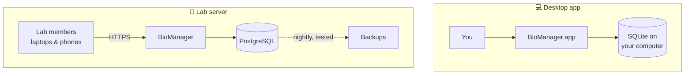

<p align="center">
  
</p>

<h1 align="center">BioManager</h1>

<p align="center">
  <b>Your lab's animals, stocks and supplies — in one place, instead of twenty spreadsheets.</b><br>
  Mice · zebrafish · flies · worms · plasmids · samples · orders · reagents · antibodies · viruses · calendar · notebook
</p>

<p align="center">
  
  
  
  
  
  <a href="LICENSE"></a>
</p>

<p align="center">
  <a href="#-what-you-can-track">What it tracks</a> ·
  <a href="#-features-across-the-app">Features</a> ·
  <a href="#-ways-to-run-it">Ways to run it</a> ·
  <a href="#-getting-started">Get started</a> ·
  <a href="#-a-first-week-with-biomanager">First week</a> ·
  <a href="#-documentation">Docs</a>
</p>

<p align="center">
  
  <br><sub><i>Home — every morning, what needs doing today.</i></sub>
</p>

---

BioManager replaces the pile of spreadsheets, whiteboards and paper cage
cards most labs run on. You edit records **the way you would in a
spreadsheet**, but underneath is a real database. It knows which mouse is
in which cage, when a litter needs weaning, which fly vials need flipping
and which antibody is about to expire — and it tells you.

It runs as a **desktop app** for one person, or on a **lab server** that
everyone signs in to from a browser, including on their phone at the rack.

<table>
  <tr>
    <td width="33%" valign="top">
      <h3>🧑‍🔬 Lab members</h3>
      Manage your own lines, fish, stocks and samples without hunting
      through someone else's spreadsheet.
    </td>
    <td width="33%" valign="top">
      <h3>📋 Lab managers &amp; PIs</h3>
      A census that is actually complete: who owns what, which cages are
      idle, what is overdue.
    </td>
    <td width="33%" valign="top">
      <h3>🧬 Multi-organism labs</h3>
      Mice, fish, flies and worms side by side — plus a database for any
      other organism, set up in a few clicks.
    </td>
  </tr>
</table>

---

## 🔬 What you can track

| | Module | In one line |
|:-:|---|---|
| 🐭 | [**Mouse colony**](#-mouse-colony) | Mice, cages, litters, breeders, strains, experiments and racks |
| 🐟 | [**Zebrafish**](#-zebrafish) | Lines, tanks, fish, clutches, matings and water systems |
| 🪰 | [**Drosophila & C. elegans**](#-drosophila-and-c-elegans) | Vials and plates, crosses, and temperature-aware flip schedules |
| 🦎 | [**Any other organism**](#-any-other-organism) | Your own database, in your own words, with no programming |
| 🧬 | [**Plasmids**](#-plasmids) | Sequences with an interactive map, and where each tube lives |
| 🧪 | [**Lab inventories**](#-lab-inventories) | Samples, orders, reagents, antibodies, viruses, or a list of your own |
| 📅 | [**Calendar & notebook**](#-calendar-and-notebook) | Experiments, to-dos and colony dates; a shared lab notebook with data sheets, protocols and meeting notes |

### 🐭 Mouse colony

The most complete module, built around how a mouse room actually works.

<p align="center">
  
</p>

- **Mice** — a spreadsheet of every animal: ID, sex, age, status,
  transgenes, cage, rack, owner and notes. IDs are assigned in order and
  never reused. A mouse is alive until it has a date of death. The dot
  before its ID shows its age at a glance: blue under 8 weeks, green from
  8 to 30 weeks, red past 30 weeks, and grey once it is not alive.
- **Cages** — every cage with its rack position, purpose, the mice
  inside (with the sex breakdown), litter born and the P21 weaning date
  side by side, then its genotype and owner. Type over a cage's number to
  renumber it; its mice go with it. A chip for each purpose (Experiments,
  Breeder…) shows just those cages.
  Each cage shows its mice beneath it, to edit right there and wean
  (**Close all** folds them to one row each), or switch to **Cards**: a
  card per cage with its mice and its actions, as on a rack.
- **Litters** — record a birth once, and the weaning date (P21) and
  genotyping date (about P28) follow from it. New litters are numbered
  L-1, L-2, L-3… **Wean** starts filled with
  the cage's pups, females and males apart; weaning before P18 asks first,
  and a weaned litter leaves every list. Birth dates in the future are
  refused.
- **Breeders** — breeding cages at a glance, with breeders past 30 weeks
  flagged.
- **Strains** and **Experiments** — your lab's lines with owners, and
  groups of mice under one experiment with a shared treatment group.
  An experiment's page has its details on top; then a **sheet of its
  mice** that switches between **Treatment** (each manipulation day as a
  column: who got it, and how much) and **Body weight** (a column a day,
  typed in place); then the body weight over the days as a chart, the
  manipulation days dashed, each saying what was done when you point at
  it. **Record manipulation** records what you just did (Tamoxifen
  20 mg/kg i.p. to the HDM group, today), or a day of the **Regimen**
  (HDM 25 µg intranasal on days 2–5), with each mouse's dose worked out
  from its latest weight, and the volume given the solution's
  concentration. Day 1 is the start date. The readout can be body weight,
  tumour volume, a clinical score, survival or your own.
  - **The regimen reminds you; you record it.** Days still to do are on
    the calendar, and the experiment's owner gets a notification each
    morning of what is due (Settings → Notifications → Experiments).
    Nothing is marked done until someone records it. **Save as a
    regimen…** keeps a regimen to start the next cohort from.
  - **What was used**: pick the reagent from your inventories and its lot
    is kept with the day (an expired lot is flagged). When a day is a
    sampling, you can choose to **make a sample record for each mouse** in
    Samples, its source that mouse.
  - **Tests by day**: stars on the chart where the groups differ (Welch's
    t-test for two groups, one-way ANOVA for more, χ² for survival
    counts), with each test in a table below it.
  - **Export** gives an Excel workbook: the readout (long, for Prism or R,
    and wide), each animal's manipulations, and the tests.
  - **Bench mode**, on a phone (scan its QR code): one animal at a time,
    with big numbers: weigh or count each, or give each today's
    manipulation and tick it. **Scan a card** reads a cage, tank or vial
    card with the phone's camera and jumps to the animal in it.

<table>
  <tr>
    <td width="50%"></td>
    <td width="50%"></td>
  </tr>
  <tr>
    <td align="center"><sub><b>Cages</b> — one row per cage, mice one click away</sub></td>
    <td align="center"><sub><b>Rack grid</b> — drag a cage to move it</sub></td>
  </tr>
</table>

### 🐟 Zebrafish

Lines, tanks, individual fish, clutches, matings (and returning the fish
afterwards), water systems with water-quality logs, and a sac log. A tank
can hold a group with a headcount, or resolve into named individuals.
A fish row's dot is blue under 3 months post fertilisation, green to 18
months and red after. The **Experiments** tab, beside Tanks and Fish, works as the mouse
colony's does, with fish in mind: start with a tank's fish rows, or a clutch's
larvae, record drug in the water, microinjection, a heat shock or an
injury, and follow survival (how many of those at the start are still
alive), standard length or a phenotype.

### 🪰 Drosophila and C. elegans

Vial (fly) and plate (worm) databases, organised into racks inside
incubators.

- Label each vial with its genotype and purpose: stock, experiment,
  cross or progeny.
- **Set crosses**, collect eggs or pick progeny into new vials, and see
  when the progeny will be adults.
- **Flip / chunk schedules that follow temperature** — flip every 14 days
  at 25 °C, every 28 at 18 °C — and they show up on Home when due.
- **Each rack's grid says when it was last flipped** and when the next is
  due (red when overdue), with a **Flipped today** button beside Edit.
- A vial's or plate's dot is blue while its progeny are still developing,
  green once they are adults, and red once it is older than its rack's
  flip or chunk interval.
- Frozen-stock records for worms.
- An **Experiments** tab for vials or plates (a rack's at once), with
  the manipulations flies and worms get: drug in the food or on the plate,
  RNAi feeding, a temperature shift, starvation, infection, flipping to
  fresh food. They have no body weight, so the readout is **survival**
  (how many of those at the start are alive), or eclosion and climbing for
  flies, brood size and paralysis for worms.

<table>
  <tr>
    <td width="50%"></td>
    <td width="50%"></td>
  </tr>
  <tr>
    <td align="center"><sub><b>Vials</b> — genotype, purpose, incubator, rack</sub></td>
    <td align="center"><sub><b>Grid</b> — the rack as it sits in the incubator</sub></td>
  </tr>
</table>

### 🦎 Any other organism

Choose **Add database** in the sidebar, start from a preset or a blank
sheet, and describe your organism:

- **The words it uses** — cage, tank, vial or plate; strain, line or
  stock; litter, clutch or progeny. The interface then speaks your
  language.
- **How it is counted** — individual animals, groups with a headcount,
  or both.
- **What it needs**, from a checklist — crosses, cohorts, a nursery
  stage, genotyping, environment logs, cryo inventory, census and more.
- **Schedules** like "wean at P21", which can vary with rearing
  temperature. Each rule counts from its own last **Done** (feeding
  doesn't restart the split's clock), and Done can be dated to the day it
  was really done.
- **Your own columns** — text, numbers, dates, dropdowns, people or links,
  edited in the sheet like the others and set on many rows at once.
- An **Experiments** tab, the same as the mouse colony's, on your
  animals, groups or cohorts (a housing's at once), with body weight,
  length, survival or your own readout.

<p align="center">
  
</p>

> [!TIP]
> Xenopus, axolotls, cell lines, yeast strains — anything you keep in
> containers and breed or passage fits here. No code and no migration.

**Only what your lab keeps.** No database is there by default, the mouse
colony, zebrafish and plasmids included: the lab adds what it uses (from
the setup survey, or **Add database → Ready-made databases**), and an admin
can take one out again without deleting anything. **All databases** groups
them into Animals and Molecular & supplies, and every database has the same
two buttons beside its name: **Configure** (for whoever may change it) and
**All databases**. Icons are picked from a grid of the icons themselves.

### 🧬 Plasmids

Upload a GenBank, FASTA or SnapGene file and BioManager keeps the sequence
and its features, with an interactive map you can edit. Plasmid boxes sit
on the same rack grid as everything else, so every tube has an address.
Each tube keeps its miniprep's concentration (ng/µL) and 260/280, and a
plasmid can be **Lab common**: anyone can edit it (or, shared with a
project group, its members), while its owner still decides whose it is. A plasmid's page lists the notebook pages that
`@plasmid` it, and its address is its number (plasmid #12 is `/plasmid/12`).
In the sheet, **Sequence** beside a plasmid's number opens its sequence and
map (**Add sequence** when it has none yet).

<p align="center">
  
</p>

### 🧪 Lab inventories

Every inventory runs on the same engine, starting from a preset you can
change:

| Preset | Tracks |
| --- | --- |
| 🧫 **Samples** | harvested tissue and material, linked to the animal it came from, stored at RT / 4 °C / −20 °C / −80 °C / LN₂ in a box position, with its concentration, unit, 260/280, 260/230 and volume as numbers |
| 🛒 **Orders** | a board from *requested* to *ordered* to *received*, with vendor, catalogue number, price and grant account |
| ⚗️ **Reagents** | quantity, concentration, CAS number, hazard, supplier and lot, and expiry dates with warnings |
| 🔬 **Antibodies** | host, clonality, clone, conjugate, reactivity, applications, dilution, RRID and where each vial is stored |
| 🦠 **Viruses** | AAV, lentivirus, rabies and other vectors: serotype, promoter, payload, titer, biosafety level, the date made, and the plasmid each was made from — which opens that plasmid, whose page lists every virus made from it |
| 🧬 **Primers & oligos** | sequence, direction, target and pair, with length, GC % and Tm worked out from the sequence; **Add primer pair** makes the forward and reverse at once, linked and side by side in a box |
| 🧫 **Cell lines** | frozen vials of each line and clone: species, parent, passage, freeze date, cells per vial, mycoplasma result and date, and where each vial sits in the LN₂ boxes |
| 📝 **Custom** | whatever you define |

Each inventory can keep **your own stock** apart from **lab common
stock**, and statuses and categories can be renamed without losing items.
Renaming a database moves it to its new name's address; the old one keeps
working, so printed labels, bookmarks and `@mentions` still find it. Every
database has a name of its own (one another database has is refused), so
`@` and a name in a notebook page always means one database.

- **Filter orders by status** — one tap shows only what is requested,
  ordered, received or cancelled.
- **Expired is red** — a reagent, antibody or virus past its expiry date
  has a red dot, number, name and date; **Expired** and **Expiring soon**
  show only those.
- **Nothing half-filled** — an order can't be placed without its item,
  vendor, catalogue number and quantity. Configure chooses what any
  inventory requires.
- **Type it once** — every column suggests what the lab has typed before;
  pick an earlier item or catalogue number and the vendor, price and grant
  fill themselves in.
- **Order again** — one click on a reagent, antibody or virus starts a new order
  with its details, and the quantity, price and grant of the last time. A
  record that is already on order shows **On order**, and Order again says
  which order is open and who asked for it.
- **Requests reach the lab manager** — a new order tells the lab's admins.
- **Boxes that look after themselves** — a tube marked used up, empty or
  discarded leaves its box position free (its location note keeps where it
  was); a box can say where it is kept (−80 °C, LN₂), and what goes in
  takes that as its *Stored at*; a tube put in a box with no position takes
  the next free one. **New box** can make several alike at once
  (*Tower A 1 … 13*).
- **From the box to the shelf** — when an order is marked received,
  BioManager offers to add it to Reagents, Antibodies or Viruses with everything
  already filled in.

<table>
  <tr>
    <td width="50%"></td>
    <td width="50%"></td>
  </tr>
  <tr>
    <td align="center"><sub><b>Orders</b> — drag a card when it arrives</sub></td>
    <td align="center"><sub><b>Reagents</b> — what's low, what's expiring</sub></td>
  </tr>
</table>

### 📅 Calendar and notebook

- **Calendar** — experiments and to-dos, with colony dates (weanings,
  genotyping, sac reminders), fly and worm flips, organism schedules and
  reagent expiry filled in for you. Shows your **Google Calendar** and any
  **ICS subscription** alongside.
  - **Who sees it**: an event or to-do is yours alone, the lab's or one
    of your project groups'. Your own is seen by nobody else, admins
    included. A shared event is everyone's to see, its owner's and the
    admins' to change; a shared to-do anyone it is for can tick off.
  - **Repeating events**: every day, week or month, or every month on the
    same weekday ("the first Monday"), until a date. One date can be taken
    out (**Delete this one**) or changed on its own (**Change this one
    only**).
  - **Protocol timelines**: write the steps once in days from day 0
    (tamoxifen days 0–4, implant day 14, perfuse day 42), start them for an
    experiment or cohort, and every step lands on the calendar. Move day 0
    and they all move.
  - **Equipment booking**: time on the confocal or a rig; double bookings
    are refused, saying who has it. A booking can repeat every day, weekday
    or week until a date (if one repeat clashes, none is made), and
    **Duplicate** books the same instrument and times on another day.
    Instruments are added, renamed and removed under **Manage**.
  - **Time away**: leave and conferences, with what falls due while you
    are away and who covers it (they are told).
  - **On your phone**: a private link that Apple, Google or Outlook
    Calendar subscribes to, with just your things or the whole lab.
- **Lab notebook** — pages in topics, written like a document and saved as
  Markdown. A page links to mice, plasmids, orders and any inventory record
  (`@mouse 12`, `@antibodies 5`): type **@** and a name (written as it is,
  `anti-β-actin` or `Waf1/Cip1`), a catalogue number or lot, a database's
  name (`@antib` offers Antibodies and lists its records) or a colleague's
  name, for `@jordan`; the chip shows the
  record's name after its number, and its popover shows its lot and place. The record's
  dialog lists the pages that link it (**Used in notebook pages**), so the
  record and the notes point at each other. Type **/** on a new line for
  everything below.
  - **Experiments**: aim, setup, samples and lot numbers, steps, results.
    *Start* and *Finished* stamp the times; planned, running, done or
    failed shows in the sidebar.
  - **Sign** a page when it should be the record of your work (your
    choice, page by page): you confirm who you are, its exact text is
    fingerprinted and kept, any live experiment in it is frozen, and it is
    locked. A lab mate can **witness** it; to change it, its owner
    **amends** it with a reason, which stays in the record with every
    signature. A signed page can't be deleted.
  - **Colony experiment** (`/experiment`) shows a mouse experiment in the
    page: its manipulations, when each was done and by whom, the amount
    each mouse got, and its body weights as a table and a chart (grams or
    % of the first weight, manipulation days marked), kept up to date.
    **Freeze a copy** keeps what it shows at that moment in the page. On
    the experiment itself, **Add to notebook** makes your notebook page
    for it with that block already in.
  - **Protocols** with numbered versions. *Start an experiment from it*
    copies the steps as a checklist and records which version was followed.
    **Protocols** in the sidebar (or `/protocol` in a page) opens the
    library: the lab's protocols and a dozen common ones built in
    (genotyping, perfusion, immunofluorescence, western, BCA,
    transformation, miniprep, TRIzol, qPCR, passaging, tamoxifen), to insert
    as a checklist or copy into a protocol of your own.
    **Run mode** goes through the checklist at the bench one step at a time
    in large type: each tick gets the time, a deviation is written under the
    page's Deviations heading.
  - **Data sheets**: paste from Excel or import a CSV, add formula columns
    (`=B/mean(B)*100`), and get a bar, dot, box, scatter or line plot with
    SEM or SD error bars, a fitted line, and a t-test, Mann–Whitney or ANOVA
    (Holm-corrected pairs) with significance stars. Plots download as SVG or
    PNG.
  - **Plate reader and qPCR**: paste readings onto a 6- to 384-well
    heatmap, mark blanks, standards and samples, and read concentrations off
    the standard curve; paste Ct values and get ΔΔCt fold changes.
  - **Buffer recipes**: final volume and concentrations in, grams and
    millilitres to add out (from molecular weight or a stock); change the
    volume and every amount follows. Common buffers are built in; the lab's
    own are saved to a shared library.
  - **Calculators**: dilution (C₁V₁ = C₂V₂), molarity, master mix, serial
    dilution, ligation insert, cell counting and seeding, agarose gel,
    DNA/RNA concentration and copy number, and protein concentration from
    A₂₈₀ (µM and mg/mL, with ε and MW worked out from a pasted sequence).
  - **Templates**: **Save as template** keeps the page's type (an
    Experiment template makes Experiments). **Structure only** keeps the
    headings, steps and table headers and leaves out the results, ticks,
    readings, pictures and the writing under Results, Observations or
    Conclusion; **Share it with the lab** lets everyone start a
    page from it.
  - **Timers**: every duration written in a step ("incubate 30 min") gets a
    ⏱ button, named from the step's words; timers keep running across pages and ring, vibrate and notify
    when they end.
  - **Daily log**: *Today* opens the day's page; each quick entry is added
    with the time.
  - **Meetings and seminars**: a rotation of who presents next, notes for
    each meeting shared with everyone in it, the coming meetings on the
    calendar, and action items (`- [ ] @name order primers, due
    2026-10-02`) sent to each person's to-dos, from any page with ⋯ →
    **Send @name tasks as to-dos**.
  - **Markdown, plus**: tables, checklists, code, equations in LaTeX
    (`$…$` inline or an equation block), Mermaid diagrams (flowcharts,
    sequence, Gantt timelines) and mind maps from an indented list. Edit
    the page as Markdown, download it as `.md`, or import `.md` files.
  - **Pictures and files**: paste, drop, or take a photo on the phone.
  - **Working together**: share a page with lab mates (or the whole lab)
    to read or to edit. Editors write in it at the same time and see each
    other's cursors. Comments sit on a passage of text, and an `@name`
    tells that person, as it does in any record's notes (a reagent, an
    order, a plasmid, a cage). A mention of a mouse, plasmid or order opens that
    record in a new BioManager tab. Anyone can turn these notebook notices off under
    **Settings → Notifications**.
  - **Version history**: every editing session is kept, compared line by
    line with the page now, and any version can be restored.
  - **Tags and search** across every page you own or that is shared with
    you, by words, kind, status, tag and date.
- **Utilities** — 41 bench calculators, answering as you type:
  solutions and buffers (molarity, dilutions, serial dilutions, percent and
  ×-fold stocks, buffer pH, osmolarity, another salt or hydrate), DNA and
  RNA (A₂₆₀, moles and copies, oligo Tm, ligation, HiFi/Gibson assembly,
  master mixes, qPCR efficiency, ΔΔCt, transformation efficiency), protein
  (A₂₈₀, MW/ε/pI from the sequence, BCA or Bradford standard curves,
  SDS-PAGE recipes, µg per lane), cells (counts, seeding, doubling time,
  transfection, MOI, lentivirus titer, freezing down, drug and vehicle),
  bacteria (OD₆₀₀, time to an OD, antibiotics), rpm ↔ × g, doses by body
  weight, agarose gels, radioactive decay, statistics, group sizes and a
  unit converter. Reference tables for culture vessels, buffers,
  antibiotics, gels, isotopes and molecular weights (the lab's own first).

<p align="center">
  
</p>

<p align="center">
  
</p>

---

## ✨ Features across the app

<table>
  <tr>
    <td width="50%" valign="top">
      <h4>☀️ A home page that tells you what to do</h4>
      Mice older than 30 weeks, upcoming weanings, the genotyping queue,
      vials due for flipping, expiring stock, zebrafish tasks, the next
      14 days and recent orders. Three layouts, switched on Home:
      <b>Classic</b> cards, <b>Tracks</b> (the coming weeks on one day
      ruler, a track per kind of work) and <b>Freezer</b> (your racks from
      above, with a pull list in the order you'd walk the room).
      <b>Customize</b> chooses which cards Classic shows, in what order
      and how wide, with your to-dos, bookings, recent pages and
      calculators (the ones you opened last) to add.
    </td>
    <td width="50%" valign="top">
      <h4>📊 Spreadsheet-style editing</h4>
      Click a cell and type; it saves as you go. Every table sorts,
      filters, exports to CSV and prints, and keeps your sort and filter
      (the filter also in its address, for a bookmark). The page scrolls,
      not the table: its search and buttons stay at the top of the window
      and its count at the bottom, with <b>New</b> at the bottom left, which
      adds an empty row at the end to type in (a strain, fish, line, plasmid
      or order, which need a name or a tank first, opens its form). Years of history stay quick:
      mice that died, cages emptied, tubes used up and vials discarded
      more than 90 days ago wait behind <b>Show them</b> at the top of
      the sheet, and are still found by search and in every export.
    </td>
  </tr>
  <tr>
    <td valign="top">
      <h4>➕ Add many at once</h4>
      Describe one mouse and say how many (<code>4 females, 2 males</code>),
      or upload a CSV from the template (Excel's dates are read as
      written). You check an editable preview — IDs included — before
      anything is saved. <b>Fill down</b> (<kbd>Ctrl</kbd> + <kbd>D</kbd>)
      works as in a spreadsheet, and a column of readings pasted into a
      sheet cell fills the cells below (a Nanodrop block steps over the
      unit column, and says which rows it filled).
    </td>
    <td valign="top">
      <h4>↩️ Batch actions with undo</h4>
      Tick rows, then <b>Set field</b> (any column, your own included), add
      them to an experiment or sac them.
      Every bulk action can be <b>undone</b> — unless someone has edited
      those records since, so their work is never silently lost.
    </td>
  </tr>
  <tr>
    <td valign="top">
      <h4>🗄️ Racks named your way</h4>
      <code>D7</code>, <code>4-7</code>, <code>7D</code>, <code>G12</code>
      or plain 1 to 80. Each rack keeps its own scheme, and a grid shows
      what is where.
    </td>
    <td valign="top">
      <h4>🔎 Search and tabs</h4>
      <kbd>⌘</kbd>/<kbd>Ctrl</kbd> + <kbd>K</kbd> searches everything.
      Every page opens as a tab you can reorder, <b>+</b> opens a new one
      on your start page, and your tabs are still there tomorrow.
    </td>
  </tr>
  <tr>
    <td valign="top">
      <h4>🕓 Full change history</h4>
      Every create, edit and delete is recorded with who and exactly what
      changed (<code>genotype: DBH-Cre → ∅</code>).
    </td>
    <td valign="top">
      <h4>🔐 Sign-in options and reminders</h4>
      Sign in with Google, Microsoft or a password. Optional daily emails
      list what is overdue or coming up for each person.
    </td>
  </tr>
  <tr>
    <td valign="top">
      <h4>💬 Feedback, kept in the lab</h4>
      <b>Send feedback</b>, under Help in the sidebar: say what went wrong, an idea or a
      question, from the page you're on. The lab's admins read it and mark
      it done; <b>Open as a GitHub issue</b> sends it on to BioManager's
      makers, only if you choose.
    </td>
    <td valign="top">
      <h4>📈 A usage report for a pilot</h4>
      Admins find a <b>Usage report</b> on the Feedback page: for each of
      the last eight weeks, how many people changed something and how many
      changes in each area — counts only, no names — to copy into an email.
      It also shows, word for word, the anonymous counts BioManager sends
      its makers once a day, with <b>Switch off</b>.
    </td>
  </tr>
</table>

### 📥 Coming from Excel

Every database has **Import from Excel** beside **Add many**: mice, fish,
plasmids, fly and worm vials, any organism database and every inventory.
Upload the workbook (.xlsx, any sheet) or CSV you kept your records in, as
it is:

- **Columns are matched by meaning, not just by name.** *Position*,
  *Slot* and *Well* are the position; *DOB* and *Born* the date of birth;
  *Supplier* the vendor; *Cat. No.* the catalogue number. Where a name
  could mean two things the values decide: a *Location* of `A1`, `B2`…
  is a position in a box, one of `Freezer 2` is a location note. Each match
  says why it was made, and you can change any of them.
- **The database adjusts to your sheet.** A column BioManager doesn't have
  becomes a new column (text, number or date) in inventories and organism
  databases; in the fixed ones it goes into each record's notes as
  `Header: value`, so nothing is lost.
- **Must-have columns are filled in.** If your sheet has no owner, say who
  every row belongs to (you, by default); for plasmids and stock, whether
  every row is Personal or Lab common (or a *Lab common* column says so row
  by row).
- **Values are tidied.** Excel dates in any style (day or month first,
  decided per column and otherwise by Lab setup's date style, `12-May-26`,
  or a date number; a future date of birth is left blank and kept in the
  notes), `Male`/`m`/`♂` → `M`, your lab's own statuses, people by name.
  A cell merged down over several rows (a *Cage #* typed once for its
  mice) counts for each, and cages the import makes belong to their mice's
  owner.
- **You see a preview first.** It runs through the same checks as the
  database's own dialogs and lists every row that would be skipped and why,
  by its row number in Excel. A *Total* line under the records is left out,
  and a mouse whose ID is taken (by the colony or an earlier row) gets the
  next free one, with the preview saying so. The import itself is one
  batch, so **Batch history** can undo it.

### 📱 Cage cards that open on your phone

Print correctly sized cards for cages, tanks and vials, and labels for
tubes: tick samples or reagents and press **Labels**. Scan the QR code
with any phone camera at the rack and that cage opens, ready to edit —
nobody walks back to a computer to type an ID. On a phone every sheet row
becomes a card with its columns under their names, and rack grids get a
**Move** button: tap a cage, then where it goes.

- **Label printers**: **Print on** chooses a sheet of cards for any
  printer, or a label printer's roll — Brother QL (62 × 29, 90 × 29,
  100 × 62 mm), Zebra (2 × 1, 3 × 1, 4 × 2, 4 × 2.5 in) or cryo-tube
  labels — and prints one label a page, typed to fit. Each person's
  choice is remembered.
- **What each label says**: for tubes, tick the fields (box, position, lot,
  a column such as concentration, the day printed…) and **Two lines for
  long text**, so a cryo label's name and place wrap instead of being cut.
- **Zebra**: **Download for Zebra (.zpl)** gives the labels in the
  printer's own language. Or an admin adds the Zebra's address on the
  lab's network once, and **Send to Zebra** prints them straight away.

<table>
  <tr>
    <td width="62%" valign="top"></td>
    <td width="19%" valign="top"></td>
    <td width="19%" valign="top"></td>
  </tr>
  <tr>
    <td align="center"><sub><b>Print</b> the cards</sub></td>
    <td align="center"><sub><b>Scan</b> one…</sub></td>
    <td align="center"><sub>…or check <b>Home</b></sub></td>
  </tr>
</table>

### 🌗 At home on a Mac, and in the dark

The interface follows macOS conventions and has a full dark mode. It works
in any modern browser on Windows and Linux too.

Each person can pick their own app icon in **Settings**: a double helix,
mouse, zebrafish, *C. elegans*, *Drosophila*, cryobox, microtube or petri
dish, in one of six macaron colours. The browser tab and sidebar show it,
and the app's accent colour follows it.

### 🌏 English or 中文

BioManager is in English and Simplified Chinese. It follows the language a
person's computer or browser asks for first; each person can choose for
themselves in **Settings → Language** (or the **中文 / English** switch on the
sign-in page). Every page is in both: each database, the calendar, the
notebook and experiments, Settings and the admin pages, and the messages and
notifications, which reach each person in their own language. Names, notes
and everything people type stay as written, and so do exports, labels and the
API. The website has a Chinese version too, at [biomanager.org/zh](https://biomanager.org/zh/).

<table>
  <tr>
    <td width="50%"></td>
    <td width="50%"></td>
  </tr>
</table>

---

## 🚀 Ways to run it



| | 💻 Desktop app | 🏫 Lab server | 🛠️ From source |
| --- | --- | --- | --- |
| **For** | one person, one computer | a whole lab, from any browser | developers |
| **Database** | SQLite, on your computer | PostgreSQL | SQLite (or PostgreSQL) |
| **Setup** | download and open | the desktop app sets it up for you (or Docker by hand) | Python 3.11+ and Node |
| **Backups** | `dbtool.py backup` | automatic, nightly, test-restored weekly, optional off-site copy | `dbtool.py backup` |
| **Phones & QR codes** | — only your computer, unless it shares its lab on the network | ✅ | on your local network |

> [!NOTE]
> Start on the desktop and move to a server later —
> `scripts/migrate-to-postgres.py` carries an existing database across.

### 🔁 One lab, many devices

One device holds the lab's **master copy**; every other one works on it
through its address, so nothing is ever merged and nothing written in two
places is lost. **Settings → Devices** says which device it is and lists
every computer linked to the lab:

- **A lab server** is the master copy unless an admin hands it on.
- **A desktop can open the lab in its window** (**Open the lab in this
  window**): you work on the lab itself, in the app, and the computer keeps
  its daily copy. **Go → This Computer's BioManager** comes back.
- **A desktop can share its own lab on the network** (**Share this lab on
  the network**): it becomes the master for every device on the same
  network (Wi-Fi or cable), which opens its address. The computer must
  stay on, and the connection isn't encrypted, so only on a network you
  trust.
- **An admin can hand the master copy to a linked desktop**
  (**Make it the master**, for a computer with an admin's key, open, on the
  same version). It takes a last copy, keeps its own data as a backup,
  and shares the lab on its network; the old master turns read only and
  sends everyone there. **Give the master copy back** returns it, with
  everything changed meanwhile. Sign-ins to other services (Google
  Calendar) are not carried along and are connected again.

---

## 🏁 Getting started

### 💻 Desktop app

1. Download BioManager for your system from the
   [**BioManager website**](https://biomanager.org/download.html),
   or build it yourself (below).
2. **macOS:** open the download and drag BioManager into Applications.
   The first time, **right-click the app and choose Open** — macOS asks
   once because the app is not signed through the App Store.
3. Create your account (the first account on a computer is the admin) and
   answer the short setup survey: tick what your lab keeps, and BioManager
   creates just those databases, with racks and incubators to match. Home
   then shows a **Getting started** list of first steps.

On a Mac the app has a full menu bar: **File** (New Tab ⌘T, Close Tab
⌘W, Export This Sheet ⇧⌘E, Print ⌘P), **Edit** (the usual editing
commands and Search BioManager ⌘K), **View** (Reload ⌘R, zoom, Light or
Dark whatever the system uses, Full Screen), **Go** (Back ⌘[, Forward ⌘],
Home ⇧⌘H, next and previous tab ⇧⌘] ⇧⌘[, and everything in your sidebar,
the databases on ⌘1 to ⌘9), **Window** and **Help** (the user guide,
keyboard shortcuts, what's new, report a problem). **Settings…** is ⌘,.
On Windows and Linux the same destinations are in File, Go and Help.

**Check for Updates…** (in the BioManager menu, or Help on Windows and
Linux) asks GitHub for the latest release and, if it is newer, shows
what's new. **Install and Restart** downloads it, checks it against the
checksum GitHub publishes, and swaps it in as the app quits (the old one
is kept until the new one opens); where it can't (the Linux .tar.gz, a
folder it can't write to), it opens the download in your browser. The
app also checks by itself, at most once a day; turn that off with
**Check for Updates Automatically**. The check sends nothing but the app's
version.

After an update (the desktop app's, or the lab server's), the first page
each person opens shows a short **What's new**: what is new, what works
differently and what was fixed, with a link to the full release notes.
**Got it** closes it for good; **Help → What's new** opens it again.

The window keeps you signed in and keeps your tabs from one launch to
the next, as a browser does.

On Windows the window is Microsoft Edge WebView2, which Windows 11 has. A
Windows 10 PC without it gets an offer to download it from Microsoft, and
BioManager opens in the web browser meanwhile (leave its message open while
you use it); once it is installed, BioManager opens in its own window again.

Your data lives outside the app, so updating or reinstalling never
touches it:

| System | Data folder |
| --- | --- |
| macOS | `~/Library/Application Support/Biomanager/` |
| Windows | `%APPDATA%\Biomanager\` |
| Linux | `~/.local/share/Biomanager/` |

<details>
<summary><b>Build the desktop app yourself</b></summary>

```bash
./scripts/build-desktop.sh
open dist/BioManager.app
```

This produces `dist/BioManager.app` on macOS, or `dist/BioManager/` on
Windows and Linux.
</details>

### 🏫 Lab server

**The easy way: let the desktop app do it.** In the desktop app, choose
**Set up a lab server** (on the welcome page, or in Settings) and say where
it should run:

- a cloud server reached privately over **Tailscale** (recommended; Oracle's
  free tier is enough), or one with the lab's **own web address**;
- a **university or department server**;
- a **Linux computer in the lab**, or **this computer** if it has Docker.

It signs in over SSH with your key, installs Docker (and Tailscale) if
needed, downloads the release's server bundle, writes its settings with a
fresh database password, can bring the desktop app's records along, starts
it, sets up alerts and backups, and checks that it answers. Every step and
every command is shown before and while it runs; at the end you get the
address and the setup code for the admin account.

**By hand:** the supported setup is the Docker stack in [`deploy/`](deploy/README.md):
HTTPS, PostgreSQL, and a backup service that dumps the database every
night, checks each dump and test-restores one every week.

```bash
git clone <this repository> biomanager && cd biomanager/deploy
cp .env.example .env && chmod 600 .env     # set DOMAIN, POSTGRES_PASSWORD, TZ
docker compose up -d --build
docker compose logs app | grep "setup code"
```

Open `https://<your domain>/register` and create the first account with
the **setup code** from the log. That account is the admin; signing in,
it answers four questions about what the lab keeps, and BioManager sets
itself up to match.

> [!IMPORTANT]
> Keep the server off the open internet: on the campus network, a VPN, or
> a private network such as Tailscale — `deploy/README.md` walks through
> it. [`deploy/RUNBOOK.md`](deploy/RUNBOOK.md) covers what to do when
> something goes wrong.

<details>
<summary><b>🛠️ Run from source</b></summary>

```bash
python3 -m venv .venv && source .venv/bin/activate
pip install -r requirements.txt
(cd frontend && npm install && npm run build:css)
PORT=5055 python run.py
```

Open <http://127.0.0.1:5055> (on macOS, AirPlay holds port 5000). The
first account needs the setup code printed in the terminal.

Want something to click around in? `python scripts/demo-data.py
/tmp/biomanager-demo` builds a made-up lab — the one in these
screenshots — and `BIOMANAGER_DATA_DIR=/tmp/biomanager-demo python run.py`
opens it.
</details>

---

## 📆 A first week with BioManager

A walk-through for a mouse colony. The other modules work the same way.

<table>
  <tr>
    <td valign="top" width="25%">
      <h4>Day 1 · Set up</h4>
      <ol>
        <li>Sign in as the admin; approve colleagues in <b>Settings → Manage users</b>.</li>
        <li><b>Mouse colony → Cages → Rack grid → New rack</b>, labelled like the stickers on your real racks.</li>
        <li>Add your lines under <b>Strains</b>.</li>
      </ol>
    </td>
    <td valign="top" width="25%">
      <h4>Day 2 · Bring the mice in</h4>
      <ol>
        <li><b>Mice → Import from Excel</b>: upload your old spreadsheet as it is and check how its columns were matched.</li>
        <li>Or <b>Mice → Add many</b>: describe a group of new mice.</li>
        <li>Check the preview; <b>Fill down</b>, <b>Skip</b>, then save.</li>
        <li>Give each cage a purpose and a rack position.</li>
      </ol>
    </td>
    <td valign="top" width="25%">
      <h4>Day 3 · Label the rack</h4>
      <ol>
        <li><b>Cages → Cage cards → Print.</b></li>
        <li>One card per cage.</li>
        <li>From now on, a phone camera opens any cage.</li>
      </ol>
    </td>
    <td valign="top" width="25%">
      <h4>Every day after</h4>
      <ol>
        <li>Open <b>Home</b>: weanings, genotyping, old breeders, low stock.</li>
        <li>Click an item to go straight to it.</li>
      </ol>
    </td>
  </tr>
</table>

<details>
<summary><b>🍼 When a litter is born</b></summary>

Open the breeding cage, choose **Litter born** and confirm the date of birth
(today unless you change it). The weaning and
genotyping dates appear on Home and the calendar when they come due. At
weaning, add the pups with **Add many** and move them to their new cages.
</details>

<details>
<summary><b>🧪 When an experiment starts</b></summary>

Tick the mice on **Mice** (shift-click selects a range). In the bar that
rises from the bottom, choose **Add to experiment** and name the treatment
group. On the experiment, **Add manipulation** for each injection,
challenge or weighing day, then **Record** each day as it's done. **Add to
notebook** puts all of it in a notebook page.
</details>

<details>
<summary><b>↩️ When you make a mistake</b></summary>

Open **More → Batch history** at the foot of the sidebar and undo the bulk action. For a single
edit, the change history shows what the value used to be.
</details>

<details>
<summary><b>🦎 When you need a new kind of database</b></summary>

Choose **Add database**, pick a preset (Drosophila, C. elegans, zebrafish,
mouse) or start blank, name things your way and choose what it needs to
track.
</details>

<details>
<summary><b>⌨️ Keyboard shortcuts</b></summary>

| Keys | Does |
| --- | --- |
| <kbd>⌘/Ctrl</kbd> + <kbd>K</kbd> | Search everything |
| <kbd>⌘/Ctrl</kbd> + <kbd>B</kbd> | Show or hide the sidebar |
| <kbd>Alt</kbd> + <kbd>1</kbd>…<kbd>9</kbd> | Switch to tab 1 to 9 |
| <kbd>Alt</kbd> + <kbd>←</kbd> / <kbd>→</kbd> | Previous / next tab |
| <kbd>Alt</kbd> + <kbd>W</kbd> | Close the current tab |
| Middle-click a tab | Close it |
| <kbd>Shift</kbd>-click a row | Select a range |
</details>

---

## 👥 Accounts, permissions and privacy

- **A welcome page before signing in** says what BioManager is, lists the
  databases the lab keeps, links the user guide (and the way in from
  Excel), and leads to **Sign in** or **Create an account**. On a new
  installation it leads to creating the admin account instead.
- **The first account is the admin.** On a server it needs the setup code,
  so nobody else on the network can claim it first.
- **New sign-ups wait for an admin's approval.**
- **You edit what you own.** Your mice, cages and records are yours.
  **Shared cages and anything marked lab common belong to the whole lab.**
  A Breeder cage starts out shared; any other cage starts personal. Only a
  cage's owner or an admin shares it, makes it personal or gives it away.
  Admins can change anything.
- **Project groups.** Some of the lab working on one project can be a
  group (**More → Project groups**): an admin makes it and picks its
  members, and the group's leads may add and remove people; someone can be
  in several groups. Wherever something can be shared with the lab, it can
  be shared with one of your groups instead: a cage, a breeding tank or a
  lab stock vial is then its members' to edit, as is a plasmid
  or reagent shared with it (everyone still sees them). A database made
  for a group is seen only by its members (and admins), a group's to-dos
  are on their calendars for any of them to tick off, and a notebook page
  or template can be shared with a group. The colony's **My groups** view
  shows the mice and cages of everyone in your groups. Deleting a group
  makes what was shared with it its owner's own again (a breeding tank or
  stock vial the lab's).
- **Roles for a facility** (Manage users → role): **Animal care**
  (technicians, vets) may change any lab's animals, cages, tanks and
  vials, but not other people's experiments, notebook pages or settings
  (their own they keep like a member); a **Facility
  manager** also runs the racks, rooms, incubators, water systems and
  databases' settings, but not accounts.
- **Sign in with your institution.** Besides Google and Microsoft, a
  server can offer the institution's own sign-in (any OpenID Connect
  provider: Okta, Keycloak, Azure AD, Shibboleth's OIDC plugin), or a
  university that only speaks SAML (InCommon, eduGAIN) through CILogon
  (deploy/README.md).
- **Everyone sees every lab database** — a census with holes is not a
  census. The **My colony / My groups / Shared / Everyone** switch filters
  the view without changing who may edit what.
- **The lab sees only what it uses.** On first sign-in the admin answers
  four questions: which databases the lab keeps and which functions it
  uses. Everyone then gets exactly those, in the sidebar and on their home
  page. **Lab setup** changes it any time, switches things off (hidden,
  never deleted) and makes someone else an admin.
- **Your own databases.** Anyone can add a database **just for them**, which
  only they and the admins see, or for one of their project groups, and
  share it with a group or the lab later. Admins add databases for the
  whole lab, and decide whether members may too.
- **Notifications.** The bell tells you when someone moves or gives you
  animals, records a genotype for yours, or when an order you placed is
  ordered, received or cancelled; you choose which kinds in Settings. New
  members get a short welcome tour.
- **Guests.** An admin can let someone outside the lab in for a day to 30
  days with a **guest pass**: a one-time code instead of a password, an
  account that stops working when the pass ends, and nothing they can do
  to Lab setup or other people's records. From the internet, someone not
  signed in only ever sees the page for entering a code.
- **When someone leaves,** the admin's **Colony overview** (under **More**) shows every cage by
  owner, idle cages and living mice without a cage, and **Racks & boxes**
  hands their racks to someone else.
- **An API for scripts and instruments.** **Settings → API tokens**
  makes a token for R, a Python script, a balance or another tool; it
  reads the lab's records as JSON, or changes them, as you and with your
  permissions (*Read*, or *Read and change*; it can expire, and you or an
  admin can revoke it). Mice, cages, litters, strains, tanks and fish,
  plasmids, fly and worm vials, every inventory and every experiment can be
  read; a mouse's weights and fields, vials, inventory items and an
  experiment's readout can be written. Changes are in the change history
  under your name, marked with the token's name. The reference, with
  examples in curl, Python and R, is at `/api` on your BioManager
  (`/api/v1/openapi.json` for tools that read OpenAPI). Lab setup can keep
  tokens to admins.

  ```bash
  curl -H "Authorization: Bearer $BM_TOKEN" "https://your-server/api/v1/mice?alive=true"
  ```
- Passwords are at least 12 characters, repeated failed sign-ins are
  locked out, and changing a password signs out every other session.
- **Your data stays with you** — on your computer or your lab's server.
  None of it is sent anywhere unless you connect Google Calendar, Google or
  Microsoft sign-in, or reminder emails, or a tool you gave a token asks.
- **Anonymous counts, once a day.** So BioManager's makers know how many
  labs use it, each installation sends one short message a day: the
  version, desktop app or server, the operating system and database, how
  many members and how many were active this week (as ranges: 1, 2–5,
  6–15, 16–50, 51+), which built-in functions are on and how many databases
  of each kind, and a random id for the installation. Never names, email
  addresses, anything anyone wrote, what your databases are called, or the
  computer's name or address. It goes to PostHog, which is asked not to
  work out where it came from. The admin chooses in the setup survey, and
  the **Usage report** (Feedback → Usage report) shows exactly what is sent
  and has **Switch off**. On a server, `BIOMANAGER_TELEMETRY=0` or
  `DO_NOT_TRACK=1` turns it off for good.

## 💾 Your data and backups

> [!WARNING]
> **Don't keep the database in a cloud-synced folder** (OneDrive, Dropbox,
> Google Drive, iCloud Drive). Syncing corrupts SQLite files. BioManager
> warns you at startup if it spots this.

On a single computer:

```bash
python scripts/dbtool.py check                      # where is it, is it healthy, is it at risk
python scripts/dbtool.py backup                     # a consistent snapshot; keeps the last 30
python scripts/dbtool.py relocate ~/BioManagerData  # move it somewhere safe
python scripts/dbtool.py restore <file>
```

**Upgrading is safe.** Before a new version changes a database an older
one made, it copies it (`backups/before-upgrade-….db` in the data folder;
the last ten are kept), and every release is tested opening a demo lab
made by each earlier release, with nothing lost. To go back, close
BioManager, put that copy in place of `biomanager.db`
(`python scripts/dbtool.py restore <file>`) and open the version it came
from. A lab server takes a backup before every update.

A lab server backs itself up every night, checks every backup and
test-restores one every week, with an optional off-site copy and a nightly
copy on the admin's Mac. The desktop app can also keep **a copy of the lab
server** on any computer (**Settings → Keep a copy of your lab server**):
the whole database, checked when it arrives, refreshed daily, the newest 14
kept, and loadable into a new server if the old one is lost. Admins decide
whether members may (guests never). An admin's copy is the whole lab; a
member's holds what they can see in the app, without anyone's password,
other people's private notebook pages or personal databases, or the Audit
log. **Settings → Export my data** downloads your own mice, cages,
weights, experiments, plasmids and notebook pages as a zip at any time.

---

## 📚 Documentation

| Document | For |
| --- | --- |
| [**User guide**](https://biomanager.org/guide.html) | Using BioManager, step by step: setting up a lab, every module, phones, backups. Also under **Help** in the app's sidebar |
| [`deploy/README.md`](deploy/README.md) | Setting up a lab server: HTTPS, Tailscale, Google/Microsoft sign-in, backups, updates |
| [`deploy/RUNBOOK.md`](deploy/RUNBOOK.md) | Running a lab server: alerts, outages, restores, people joining and leaving |
| [`docs/GOOGLE_CALENDAR_SETUP.md`](docs/GOOGLE_CALENDAR_SETUP.md) | Connecting Google Calendar |
| [`docs/DEVELOPMENT.md`](docs/DEVELOPMENT.md) | How BioManager is built: stack, styling, icons, the organism engine, access control, audit and undo, tests, security settings |
| [`docs/TESTING.md`](docs/TESTING.md) | How 1.0 was tested: six areas stress-tested like a lab and an attacker would, what was found and fixed, and the full reports |

Working on BioManager itself? Start with
[`docs/DEVELOPMENT.md`](docs/DEVELOPMENT.md). The test suite runs on SQLite
and PostgreSQL with `scripts/test.sh`, on every push. To refresh these
screenshots, see `scripts/screenshots.py`.

## 🙏 Licence and credits

BioManager is released under the [MIT licence](LICENSE). If you use it in
your research, **Cite this repository** on the GitHub page gives the
citation in APA or BibTeX (from [CITATION.cff](CITATION.cff)).

Built with Python, Flask, SQLAlchemy, PostgreSQL / SQLite and Tailwind CSS.
Icons from [Font Awesome Free](https://fontawesome.com) (CC BY 4.0) and
[game-icons.net](https://game-icons.net) by Delapouite (CC BY 3.0) — the
mouse and fly are theirs; the plasmid, petri dish, cage, tank and
culture-vial icons were drawn for this project. The people and records in
the screenshots are made up.
